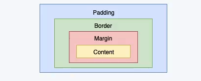
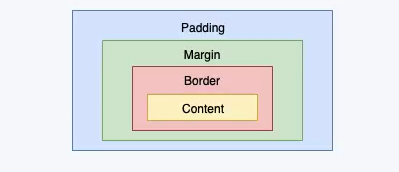
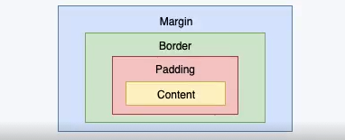
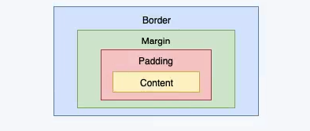
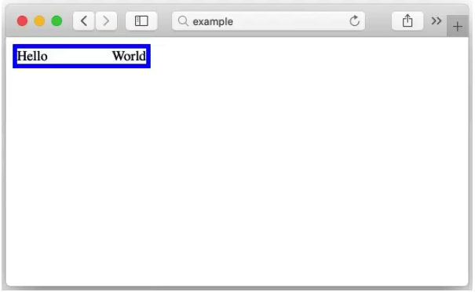
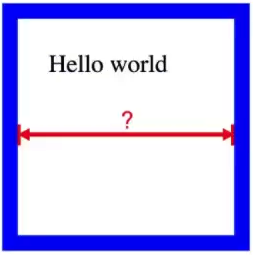

#### Q1. Consider the following Javascript code:

```js
const a = (function () {
  return parseInt("1.5");
})();
```

What is the data type of `a`?

Select the best option:

- A. function
- B. object
- C. number <<<<--- Correct
- D. string

#### Q2. What's wrong with the following JavaScript code?

```js
const testString = "hello world";
const isAllCaps = false;
if (testString === testString.toUpperCase()) {
  isAllCaps = true;
}
```

Select the best option:

- A. `if` should be replaced with `while`
- B. === should be replaced with ==
- C. `const isAllCaps = false;` should be replaced with `let isAllCaps = false;` <<<<--- Correct
- D. Nothing is wrong, the code is bug free.

#### Q3. Consider the following Javascript code:

```js
let p1 = new Promise((resolve, reject) => {
  resolve("foo");
});
let p2 = new Promise((resolve, reject) => {
  reject("bar");
});

console.log("bip");

p1.then((val) => {
  console.log(val);
  return p2;
})
  .then((val) => {
    console.log("baz");
  })
  .catch((err) => {
    console.log(err);
  });

console.log("bop");
```

What is a possible output on the console?

Select the best option:

- A. <<<<--- Correct

```
  bip
  bop
  foo
  bar

```

- B.

```
  bip
  bop
  foo
  baz

```

- C.

```
  bip
  foo
  baz
  bop

```

- D. All of the above are possible due to the nondeterministic way Promises resolve

- E. None of the above

#### Q4. What is wrong with the following ES6 code?

```js
class MyList extends Array {
  constructor(someArg) {
    this.someArg = [...someArg];
  }
}

let theList = new MyList("foo");
```

Select the best option:

- A. `MyList` extends a built-in type, which is not allowed
- B. `super()` needs to be called in the constructor <<<<--- Corect
- C. The constructor for `Array` expects no arguments or an integer argument, but we are supplying a string argument
- D. `[...someArg]` will cause a syntax error because we are supplying a string to the constructor

#### Q5. What is the value of `a` after this cde runs?

```js
function foo(obj) {
  return {
    a: obj.bar,
    b: obj.baz,
  };
}
const { a } = foo({ bar: 27, baz: 41 });
```

Select the best option:

- A. `{ a: 27, b: 41 }`
- B. `27` <<<<--- Correct
- C. `undefined`
- D. An `Error` is thrown

#### Q6. Consider the following Javascript code.

```js
for (var i = 0; i < 5; i++) {
  setTimeout(function () {
    console.log(i);
  }, 100);
}
```

What is output to the console?

Select the best option:

- A. 0
  1
  2
  3
  4

- B. 5 <<<<--- Correct
  5
  5
  5
  5

- C. 0
  0
  0
  0
  0

- D. 5

- E. 4
  4
  4
  4
  4

#### Q7. What is the value of `k` after the following Javascript code runs?

```js
let i = 3;
let j = 4;
let k = 1;
for (i = 0; i < 3; i++) {
  k += j;
  j = j - 1;
}
```

Select the best option:

- A. `10` <<<<--- Correct
- B. `11`
- C. `13`
- D. `17`

#### Q8. You are building a social media product with users and followers. Consider the following code:

```js
class User {
  /**
   * @param {string} username
   * @param {Array.<string>} tags
   */
  constructor(username, tags) {
    this.username = username;
    this.tags = tags;
    this.followers = [];
  }

  /**
   * @param {User} user
   * @returns void
   */
  addFollower(user) {
    this.followers.push(user);
  }

  /**
   * Get the followers who are tagged with `tag`
   * @param {string} tag
   * @returns {Array.<User>}
   */
  getFollowers(tag) {
    // Fill in this line
  }
}
```

Fill in the missing line. Select `ALL` that are correct.

**Select all that apply:**

- A. <<<<--- Correct

```js
return this.followers.filter((follower) => follower.tags.includes(tag));
```

- B.

```js
return this.followers.includes((follower) => follower.tags.filter(tag));
```

- C. <<<<--- Correct

```js
return this.followers.filter(
  (follower) =>
    follower.tags.filter((followerTag) => tag === followerTag).length > 0
);
```

- D.

```js
return this.followers.map((follower) => follwer.tags.includes(tag));
```

#### Q9. You are building a social network with influencers and their followers. You want to calculate the **reach** of a user. The **reach** is the number of users a given user can reach, given a certain degree of separation, including himself or herself. For example:

- At zero degrees of separation, the user can only reach himself or herself, so the reach is 1.
- At one degree of separation, the user can reach his/her direct followers plus himself/herself.
- At two degrees of freedom, the user can reach their direct followers, AND their followers' direct followers, plus himself/herself.

Fill in the missing line:

```js
class User {
  /**
   * @param {User[]} followers
   */
  constructor(followers) {
    this.followers = followers;
  }

  /**
   * The numbers of Users this User can reach with degreesOfSeparation hops,
   * including themselves
   * @param {number} degreesOfSeparation
   */
  getReach(degreesOfSeparation) {
    if (degreesOfSeparation <= 0) {
      return 1;
    }
    return (
      1 +
      this.followers
        .map((follower) => {
          // FILL IN THIS LINE
        })
        .reduce(function (a, b) {
          return a + b;
        }, 0)
    );
  }
}
```

Select the best option:

- A. `return 1;`
- B. `return follower.followers.length;`
- C. `return follower.getReach(degreesOfSeparation - 1);` <<<<--- Correct
- D. `return 1 + follower.getReach(degreesOfSeparation - 1);`

#### Q10. In CSS, what is the difference between `.foo` and `#foo`?

Select the best option:

- A. `#foo` is a hash fragment for a URL while `.foo` references a property named `"foo"`
- B. `.foo` selects block elements, while `#foo` selects inline elements.
- C. `.foo` selects by class while `#foo` selects by id <<<<--- Correct
- D. `.foo` is a valid CSS selector while `#foo` is not
- E. `.foo` and `#foo` are equivalent

#### Q11. Consider the following HTML markup:

```html
<div>
  <ul>
    <li>hey</li>
    <li>there</li>
  </ul>
  <ul>
    <li>world</li>
  </ul>
</div>
```

How many elements does the following CSS selector return?

```js
document.querySelectorAll("ul li");
```

Select the best option:

- A. `0`
- B. `1`
- C. `2`
- D. `3` <<<<--- Correct
- E. None of the above

#### Q12. Consider the following HTML markup:

```html
<ul id="mylist">
  <li>
    <ul>
      <li>A</li>
    </ul>
  </li>
  <li>
    <ul>
      <li>B</li>
      <li>C</li>
    </ul>
  </li>
</ul>
```

Using modern CSS selector syntax, how would you select _only_ the `<li>` element with the "A" in it?

Select the best option:

- A. `#mylist li ul li`
- B. `#mylist > li > ul > li`
- C. `#mylist > li ul li`
- D. It is impossible to do with CSS selector syntax
- E. It is possible to do with CSS selector syntax, but none of the choices above are correct. <<<<--- Correct

#### Q13. In CSS rendering, which of the following depicts the correct relationship between an element's content, margin, padding, and border?

Select the best option:

- A.
  

- B.
  

- C.
  

- D. <<<<--- Correct
  

- E. None of the above

#### Q14. Consider the following markup.

```html
<!DOCTYPE html>
	...
	<body>
		<div id="foo"></div>
		<div id="bar"></div>
	</body>
</html>
```

```css
#foo {
  width: 100px;
  padding: 10px;
  margin: 5px;
  border: 1px solid black;
}

#bar {
  width: 100px;
  padding: 15px;
  margin: 0px;
  border: 1px solid black;
}
```

Which element is visually wider, `#foo` or `#bar`? Assume `box-sizing` is `content-box`.

Select the best option:

- A. Neither. Both `foo` and `bar` have the same width. They are both 100px.
- B. Neither. Both `foo` and `bar` have the same width. As `<div>` elements, they are both as wide as the `<body>`.
- C. `foo` is wider than `bar`
- D. `bar` is wider than `foo` <<<<--- Correct
- E. Neither. Both `foo` and `bar` are invisible.

#### Q15. Consider the following screenshot and markup:



```html
<div id="foo">
  <span id="hello">Hello</span>
  <span id="world">World</span>
</div>

<style>
  #foo {
    border: 5px solid blue;
    width: 150px;
  }
</style>
```

Which of the following additional CSS snippets will make it look MOST like the above screensot?

Select the best option:

- A.

```css
#hello {
  float: left;
}
#world {
  float: right;
}
```

- B. <<<<--- Correct

```css
#foo {
  display: flex;
  flex-direction: row;
  justify-content: space-between;
}
```

- C.

```css
#hello {
  text-align: left;
}
#world {
  text-align: right;
}
```

- D.

```css
#foo {
  position: absolute;
}
#hello {
  display: block;
  left: 0;
}
#world {
  display: block;
  right: 0;
}
```

- E.

```css
#foo {
  position: absolute;
}
#hello {
  display: inline-block;
  left: 0;
}
#world {
  display: inline-block;
  right: 0;
}
```

#### Q16. Consider the following markup.

```html
<!DOCTYPE html>
<html>
  ...
  <body>
    <span>Well, hello</span>
  </body>
</html>
```

```css
span {
  margin: 10px 0px 10px 0;
  padding: 10px;
  font-size: 28px;
  line-height: 36px;
}
```

Which CSS rule does not have any visual effect on the element?

Select the best option:

- A. `margin: 10px 0px 10px 0;` <<<<--- Correct
- B. `padding: 10px;`
- C. `font-size: 28px;`
- D. `line-height: 36px;`
- E. All of the CSS rules have a visual effect

#### Q17. Consider the following markup and rendering:

```html
<html>
  <head>
    <style>
      div {
        width: 100px;
        height: 100px;
        border: 10px solid blue;
        padding: 20px;
        margin: 15px;
      }
    </style>
  </head>
  <body>
    <div>Hello world</div>
  </body>
</html>
```



How may pixels is the distance marked by the red arrows?
Assume the default box sizing model.

Select the best option:

- A. 70
- B. 80
- C. 100
- D. 140 <<<<--- Correct

#### Q18. Consider the following HTML and CSS:

```html
<div>Hello world</div>
```

```css
div {
  display: flex;
  width: 200px;
  height: 100px;
  border: 5px solid blue;
}
```

Which additional CSS rule(s) will render the following image? Choose ALL that apply.


**Select all that apply:**

- A.

```css
div {
  flex-direction: column;
  align-items: center;
}
```

- B. <<<<--- Correct

````css
div {
  flex-direction: row;
  align-items: center;
}
- C. <<<<--- Correct ```css div {
  flex-direction: column;
  justify-content: center;
}
````

- D.

```css
div {
  flex-direction: row;
  justify-content: center;
}
```

#### Q19. A web developer wants to display "Hello World" three times but their code is only displaying "Hello World" once. Removing one line will fix the bug. Which line should be removed?

```html
<ul id="todo-list">
  <li class="one">Hello World</li>
  <li class="two">Hello World</li>
</ul>
```

```js
const thirdItem = document.createElement("li");
thirdItem.classList.add("three");
document.querySelector("#todo-list").appendChild(thirdItem);
document.querySelector("#todo-list").classList.add("text");
document
  .querySelectorAll("li")
  .forEach((element) => element.classList.add("text"));
document
  .querySelectorAll(".text")
  .forEach((element) => (element.textContent = "Hello World"));
```

Select the best option:

- A. `document.querySelector("#todo-list").appendChild(thirdItem);`
- B. `document.querySelector("#todo-list").classList.add("text");` <<<<--- Correct
- C. `document.querySelectorAll("li").forEach((element) => element.classList.add("text"));`
- D. `document.querySelectorAll(".text").forEach((element) => (element.textContent = "Hello World"));`

#### Q20. You're tasked with fetching the HTTP status codes for a list of URLs using fetch() ([https://developer.mozilla.org/en-US/docs/Web/API/Fetch_API/Using_Fetch](https://developer.mozilla.org/en-US/docs/Web/API/Fetch_API/Using_Fetch))

Fill in the missing line of JavaScript:

```js
async function fetchStatusCodes(urls) {
  // ??? Fill in this line
  return httpResponses.map((response) => response.status);
}

(async () => {
  const statusCodes = await fetchStatusCodes([
    "https://example.com",
    "https://example.com/bar",
    "https://example.com/baz",
  ]);
  // statusCodes == [200, 404, 404]
})();
```

Select the best option:

- A.

```js
const httpResponses = await urls.map(async (url) => fetch(url));
```

- B.

```js
const httpResponses = urls.map((url) => await fetch(url));
```

- C.

```js
const httpResponses = Promise.all(urls, async (url) => fetch(url));
```

- D. <<<<--- Correct

```js
const httpResponses = await Promise.all(urls.map(async (url) => fetch(url));
```
